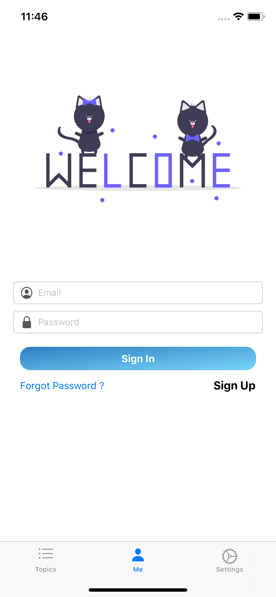
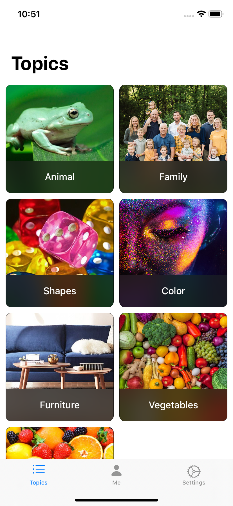
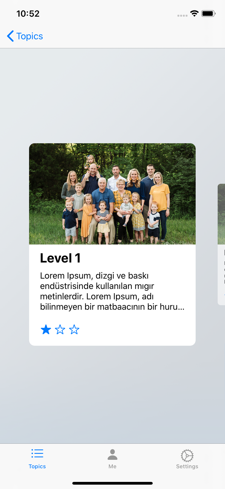
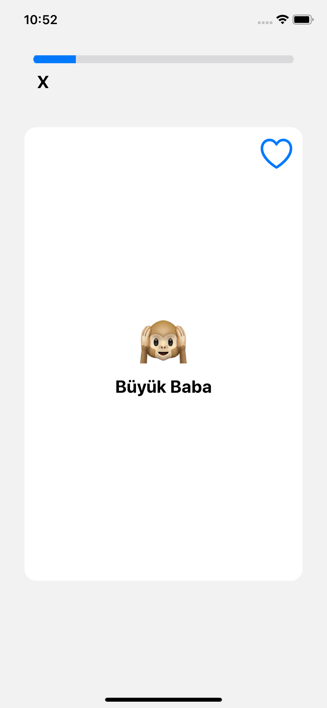
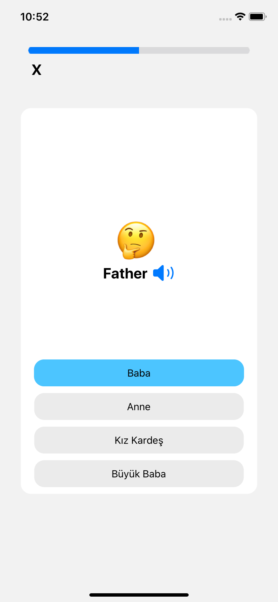
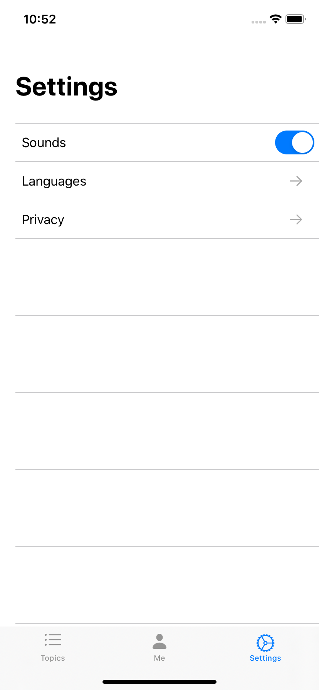
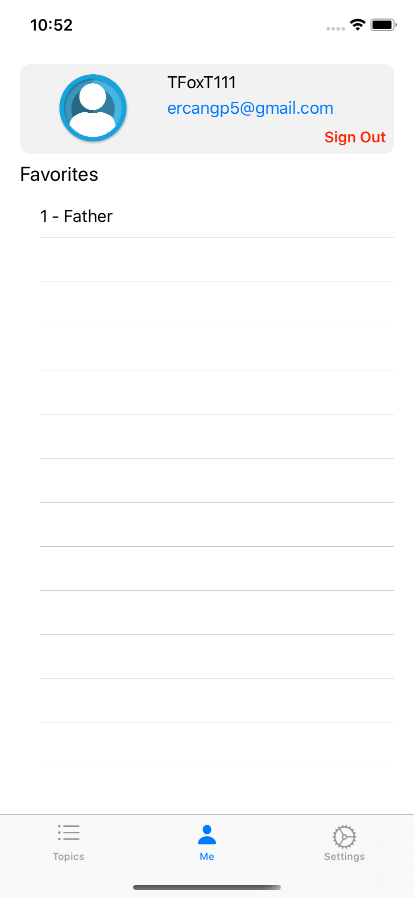

# EnglishCards

Vocabulary learning practice with flash card.

# Languages / Frameworks Used

Swift 5 
UIKit 
CoreAnimation

# 3rd Party

Lottie 
Alamofire 
Firebase 
KingFisher 
Paper_onboarding 

# Design Pattern

MVVM

# Tested On

Iphone 11 Max Pro 
Iphone 11 
Iphone 8 plus 
Ipad 9 pro 

# Images

  ------    ------   

  ------    ------   
